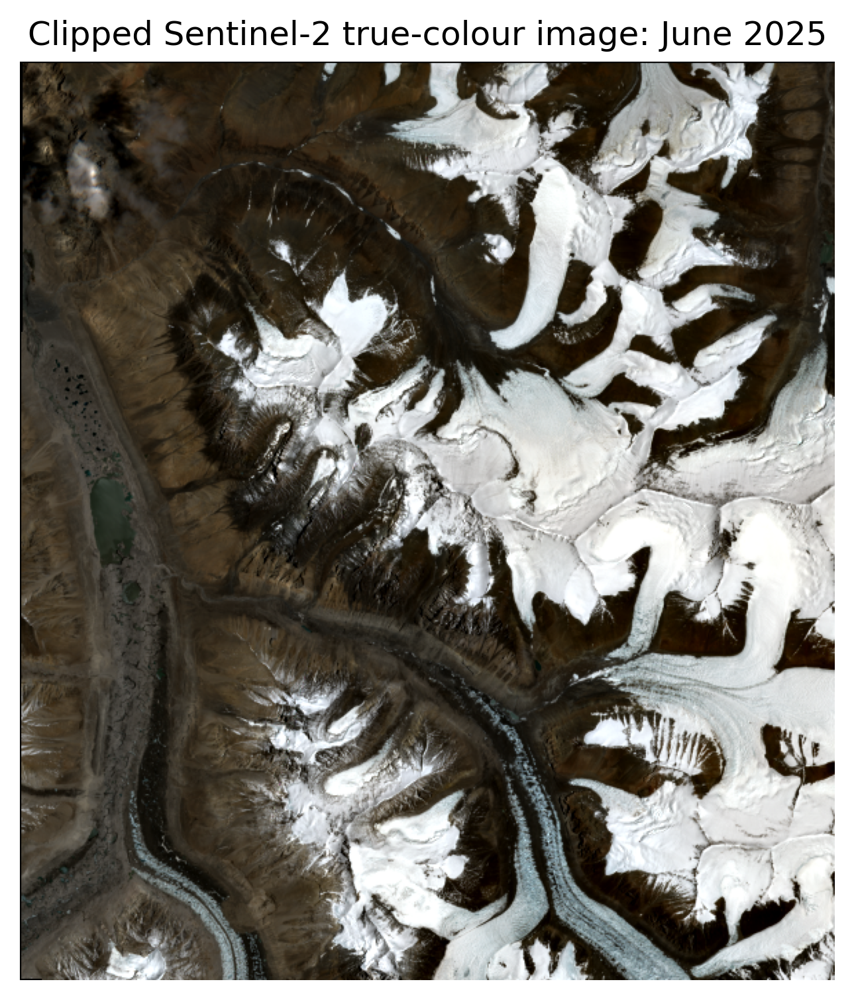
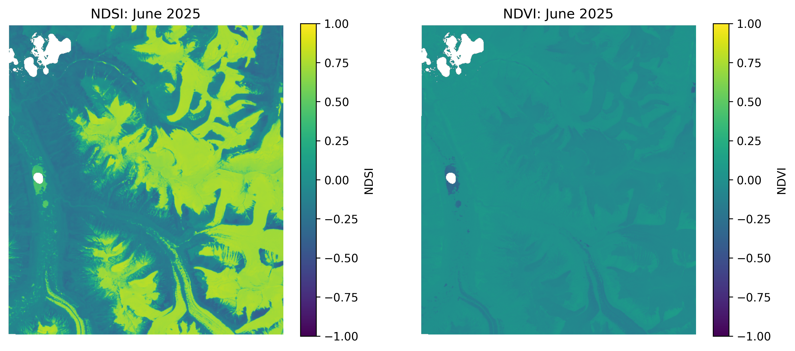
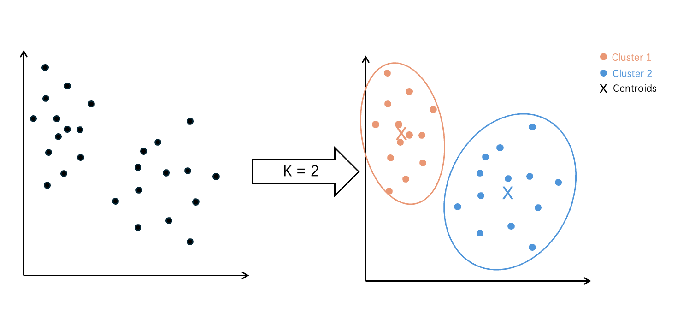
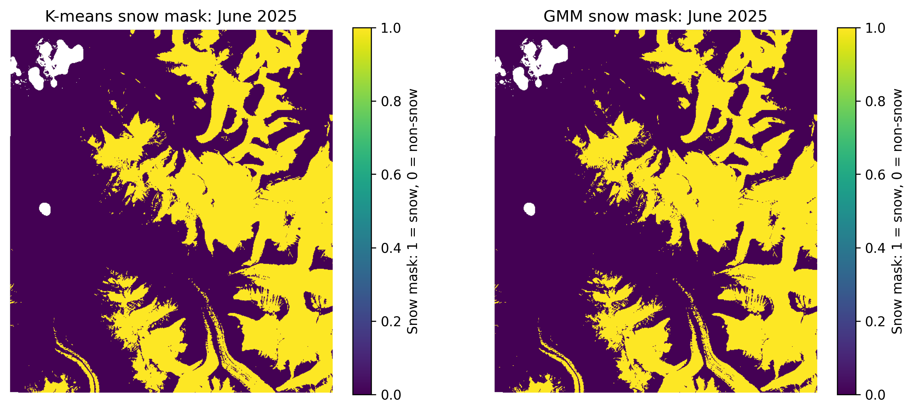
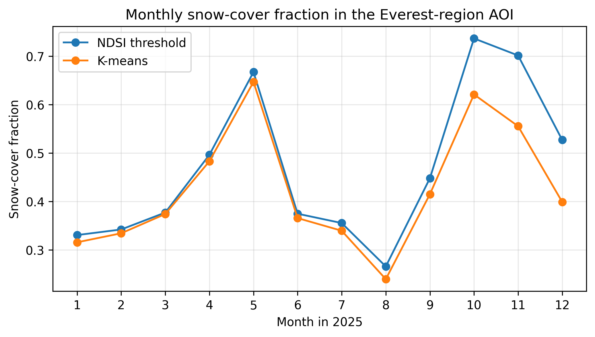
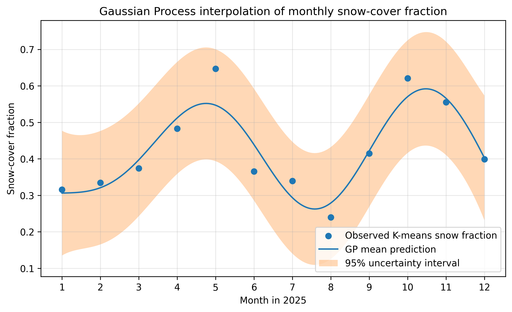
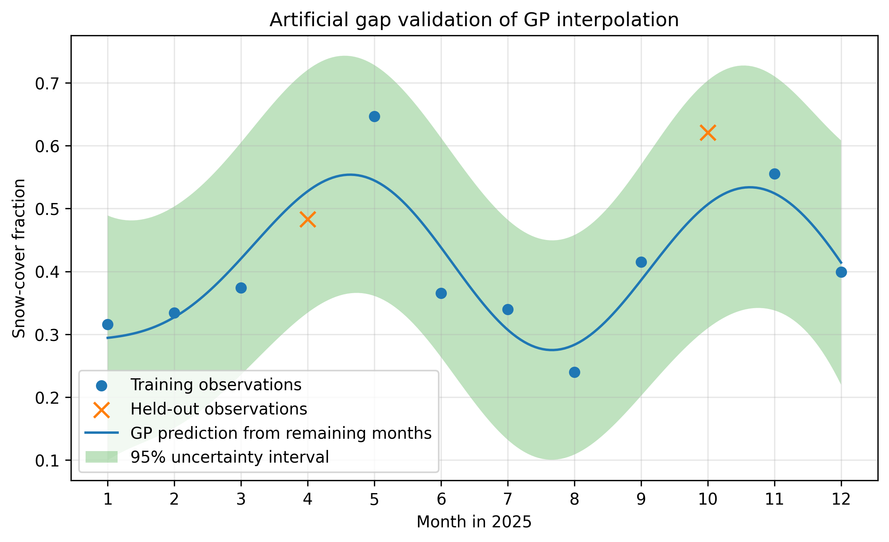

# Everest Snow Cover AI4EO
### Monitoring seasonal snow-cover variability in the western Mount Everest during 2025 using Sentinel-2 imagery, unsupervised classification, and Gaussian Process interpolation.

<p align="center">
  
</p>


## Project Overview

This project aims to map and estimate seasonal snow-cover variability in a selected area of the western Everest using one Sentinel-2 Level-2A scene for each month of 2025.

The Sentinel-2 images are first clipped to the study area and filtered using the Scene Classification Layer (SCL) to remove invalid, cloud-contaminated and cloud-shadow pixels. Normalized Difference Snow Index (NDSI) and Normalized Difference Vegetation Index (NDVI) are then calculated from the Sentinel-2 reflectance bands.

A fixed NDSI-threshold method is used as a baseline, while K-means clustering is then applied as the main unsupervised classification method to separate snow-dominated and non-snow-dominated pixels. A Gaussian Mixture Model (GMM) is also tested on one representative June scene to compare with the K-means classification, and see if the snow/non-snow classification is sensitive to different unsupervised learning methods.

Finally, the monthly K-means snow-cover fractions are used as input for Gaussian Process regression to reconstruct a seasonal snow-cover curve with uncertainty estimates. An artificial gap validation is also included to test whether the Gaussian Process model can reasonably estimate missing monthly observations.

The main outputs are monthly snow masks, a snow-cover fraction time series, a Gaussian Process seasonal reconstruction, and a simple validation of gap-filling performance.


## Background and Problem Statement

Seasonal snow cover is crucial in high-mountain regions because it influences hydrology, climate processes and water availability. Himalayan river systems depend partly on snow and glacier melt during the summer months, and the snow is accumulated again in the winter, so monitoring the snow cover variability is helpful for understanding changes in mountain water resources (Kulkarni et al., 2010). This project applies this problems to a selected Area of Interest (AOI) in the western Mount Everest region, where steep topography, seasonal snow, rock, ice and shadowed terrain make local snow-cover mapping a useful but challenging remote sensing task.

Satellite remote sensing is suitable for this problem because field observations in high mountain topography are difficult, spatially limited and affected by harsh weather conditions. Sentinel-2 provides freely available multispectral imagery with relatively high resolution, which makes it suitable for regional snow-cover mapping (Nagajothi et al., 2019). 

However, optical snow mapping is still challenging because the snow is highly reflective, and the cloud, shadow, water and mixed pixels can be confused with the snow signal or obscure the land surface (Gaur et al., 2021). A common remote sensing approach is to use the Normalised Difference Snow Index (NDSI), which uses the contrast between high green reflectance and low short-wave infrared reflectance of snow (Gascoin et al., 2019). This method is simple and widely used, but a fixed threshold may not capture all local surface conditions in complex mountain terrain. 

Therefore, this project combines an NDSI threshold baseline with K-means unsupervised classification for the target site, grouping pixels using multiple Sentinel-2 bands and spectral indices without requiring manually labelled training data. The second challenge is that monthly optical observations may be incomplete or uneven because of cloud cover and scene availability. To address this issue, a Gaussian Process regression is carried out using the monthly K-means snow-cover fractions, reconstructing a smooth seasonal snow-cover curve and providing uncertainty estimates between monthly observations. 
这段目前内容上我觉得还可以稍微在第一段加一些细节和内容，你可以帮我看看再补充点什么吗？还有，第二段rs的部分太少了，就两句话，可以加点general的说明吗？比如sentinel2是用什么方法测量的、resolution大概是多少这种，就是多一些background info。以及，我觉得我们可以把第四段的second challenge结合到第三段，然后第四段专门讲：Research question & Specific research objectives (可以列点讲吧？做了什么+用了什么方法)；还有一个点：我觉得我们要提一下2025，因为我们的project只用了2025的数据

## Data and Study Area

This project uses Sentinel-2 Level-2A imagery from the Copernicus Data Space. The study area is a selected Area of Interest (AOI) in the western Mount Everest region, covered by Sentinel-2 tile `45RVM`. The AOI is approximately bounded by 86.85–86.97°E and 28.05–28.17°N, with an approximate centre at 86.91°E, 28.11°N.

One Sentinel-2 imagery with the lowest reported cloud-cover value is downloaded for each month of 2025 from the available Sentinel-2 products, giving 12 monthly observations in total for the snow-cover analysis. All image processing was carried out on the 20 m grid because the SWIR band and the Scene Classification Layer used in this project are available at 20 m resolution, avoiding band-shape mismatches in further analysis.

<p align="left">
  
</p>

Information table of the downloaded materials:
| Item | Description |
|---|---|
| Satellite data | Sentinel-2 Level-2A |
| Data source | Copernicus Data Space |
| Time period | January–December 2025 |
| Study area | Western Mount Everest region AOI |
| AOI extent | 86.85–86.97°E, 28.05–28.17°N |
| AOI centre | 86.91°E, 28.11°N |
| Sentinel-2 tile | `45RVM` |
| Spatial grid used | 20 m |
| Number of scenes | 12 monthly scenes |
| Main derived output | Monthly snow-cover fraction |

The raw Sentinel-2 `.SAFE` products are not included in this repository because of their large file size. Instead, the selected product metadata and processing notebooks are provided so that the dataset can be downloaded again if needed.

## Notebook Structure

The project is organised into three Jupyter notebooks, which were developed and run in Google Colab.

| Notebook | Purpose |
|---|---|
| `01_sentinel2_data_acquisition.ipynb` | Searches, selects, downloads and extracts the monthly Sentinel-2 products. |
| `02_snow_cover_mapping_kmeans_gmm.ipynb` | Applies SCL masking, calculates NDSI and NDVI, creates NDSI-threshold and K-means snow masks, and compares K-means with GMM for one representative month. |
| `03_gp_interpolation_gap_validation.ipynb` | Uses the monthly K-means snow-cover fraction for Gaussian Process interpolation and artificial gap validation. |

## Methodology

### 1. Remote Sensing Preprocessing

The selected Sentinel-2 Level-2A products were firstly read from the extracted `SAFE` folders. Then, each monthly 20 m Sentinel-2 layers was clipped to the selected western Everest AOI. The SCL layer was used to remove invalid pixels, cloud-contaminated pixels, cirrus and cloud shadows. Snow/ice pixels were eventually retained as the target class in this project.

Two spectral indices were calculated from the Sentinel-2 reflectance bands. The Normalised Difference Snow Index (NDSI) was used as the main snow-sensitive index:

$$
NDSI = \frac{B03 - B11}{B03 + B11}
$$

where `B03` is the green band and `B11` is the short-wave infrared (SWIR) band (Nagajothi et al., 2019).
NDVI was also calculated as an auxiliary feature to help describe vegetation and other non-snow surfaces:

$$
NDVI = \frac{B8A - B04}{B8A + B04}
$$

where `B8A` is the narrow near-infrared band (NIR) and `B04` is the red band (Tempa et al., 2024).

<p align="center">
  
</p>

### 2. NDSI Threshold Baseline

A simple NDSI threshold method was used as a baseline snow-cover estimate. After SCL masking, valid pixels with `NDSI > 0.4` were classified as snow, following a commonly used threshold for binary snow mapping (Dozier, 1989; Kulkarni et al., 2010).

The snow-cover fraction for each month was calculated as:

$$
\mathrm{Snow\ cover\ fraction} = \frac{\mathrm{number\ of\ snow\ pixels}}{\mathrm{number\ of\ valid\ pixels}}
$$

This threshold-based test was used as a reference for comparing with the K-means classification, rather than as independent ground truth.

### 3. K-means Unsupervised Snow Classification

K-means is an unsupervised clustering algorithm that groups pixels with similar feature values without using labelled training data. In this project, **it was used as the main snow-classification method to separate valid pixels into two broad surface groups.**

For each monthly scene, the valid pixels were reshaped into a pixel-by-feature matrix using six input features:

- `B03` (green)
- `B04` (red)
- `B8A` (narrow NIR)
- `B11` (SWIR)
- `NDSI`
- `NDVI`

The K-means model was applied with `k = 2`, so that the valid pixels were separated into two clusters by minimising the within-cluster variance. After clustering, the mean NDSI value of each cluster was calculated. The cluster with the higher mean NDSI was interpreted as the snow cluster, and the other cluster was treated as non-snow.

<p align="center">
  
</p>

### 4. Gaussian Mixture Model (GMM) Comparison

While K-means assigns pixels to the nearest cluster centre, GMM represents each cluster as a probability distribution. This makes GMM suitable for checking whether the snow/non-snow separation is strongly affected by the choice of clustering method.

GMM was applied only to the representative example of June 2025, using the same feature stack as the K-means classification, and the higher mean NDSI was also interpreted as the snow cluster. The resulting GMM snow mask was then compared with the K-means snow mask using snow-cover fraction and pixel-level agreement.

<p align="center">
  
</p>

*This comparison is used as a method check rather than a full validation dataset, because no independent ground-truth snow labels were available.*

### 5. Gaussian Process Interpolation and Gap Validation

The Gaussian Process regression used the monthly K-means snow-cover fraction as the input time series. In this project, the input variable is month number, and the output variable is snow-cover fraction.

Gaussian Process regression treats the seasonal snow-cover curve as a distribution of possible smooth functions, rather than fitting one fixed equation. An RBF kernel was used to describe the similarity between months:

$$
k(x, x') = \exp\left(-\frac{1}{2l^2} \| x - x' \|^2\right)
$$

This kernel includes a variance parameter and assumes that nearby months are more likely to have similar snow-cover fractions than months that are farther apart. The GP model was then used to reconstruct a seasonal snow-cover curve from the 12 monthly observations and to estimate the uncertainty between observed months.

An artificial gap validation was also carried out. April and October were removed from the time series, and a new GP model was trained using the remaining months. The model predictions for the two removed months were then compared with their original K-means snow-cover fractions. This tests whether the GP model can reasonably estimate missing monthly observations.

### 6. Machine Learning Implementation Workflow

The workflow below summarises how the Sentinel-2 preprocessing, spectral-index calculation, unsupervised classification and Gaussian Process interpolation steps are connected. Small example outputs are included to show how the intermediate and final products are generated through the pipeline.

<p align="center">
  
</p>

## Results

**The main results are that K-means could produce snow-cover masks for all 12 months based on the downloadesd Sentinel-2 imageries, the K-means and GMM classifications were highly consistent for the representative June scene, and the Gaussian Process model could reconstruct a smooth seasonal snow-cover curve with uncertainty estimates successfully even when some data are missing.**

### 1. Monthly K-means Snow Masks

<p align="center">
  
</p>

The monthly K-means masks show clear seasonal changes in the study region, but the cloud covers are also significant during the summer. These masks also provide the pixel-level basis for calculating monthly snow-cover fraction.

### 2. NDSI Threshold vs K-means Snow Cover Fraction

<p align="center">
  
</p>

The NDSI threshold and K-means results show broadly similar seasonal variability, but their snow-cover fractions are not identical. This is expected because the NDSI method uses a fixed single-index threshold, while K-means uses multiple Sentinel-2 bands and spectral indices to group pixels. **In this dataset, the NDSI-threshold baseline generally gives a more inclusive snow estimate, whereas K-means provides a more conservative classification by considering the wider spectral behaviour of each pixel.** These differences are most likely to occur in mixed pixels, shadowed terrain, and pixels with intermediate NDSI values.

### 3. K-means and GMM comparison

| Method | Month | Snow-cover fraction |
|---|---:|---:|
| K-means | June | 0.365666 |
| GMM | June | 0.366181 |

The pixel-level agreement between K-means and GMM was 0.9948, meaning that about 99.5% of valid pixels received the same snow/non-snow label from both methods. This supports the use of K-means as the main classification method for the full monthly analysis.

### 4. Gaussian Process Seasonal Reconstruction

<p align="center">
  
</p>

The GP model reconstructs a smooth seasonal snow-cover curve from the 12 monthly K-means observation results. The uncertainty interval is wider between observations and near the edges of the time series, reflecting less confidence where fewer neighbouring observations constrain the prediction.

### 5. Artificial gap validation

<p align="center">
  
</p>

The GP model trained on the remaining months after April and October data are removed. A good gap-filling result is indicated when the predicted values are close to the original observations and the observed values fall within the uncertainty intervals.

| Held-out month | Observed K-means snow-cover fraction | GP predicted snow-cover fraction | 95% uncertainty interval | Absolute error | Within 95% interval? |
|---|---:|---:|---:|---:|:---:|
| April | 0.483 | 0.528 | 0.334–0.721 | 0.044 | Yes |
| October | 0.621 | 0.507 | 0.310–0.704 | 0.114 | Yes |

The full validation table is available in [`metadata/gp_artificial_gap_validation_2025.csv`](metadata/gp_artificial_gap_validation_2025.csv).

## Getting Started and Repository Structure

### Running Environment

The notebooks were developed and run in Google Colab, and Google Drive is used to store downloaded Sentinel-2 products, processed files, metadata tables and exported figures.

To mount Google Drive in Colab:

```python
from google.colab import drive
drive.mount('/content/drive')
```

Some packages are imported directly from the Colab environment, while additional packages are installed inside the notebooks where needed. For example, Notebook 3 installs GPy before running the GP model:

```python
!pip install GPy
```

If Colab asks for a runtime restart after installing `GPy`, restart the runtime and then rerun the notebook cells from the beginning.

### Running order

To reproduce the workflow, run the notebooks in order:

1. `01_sentinel2_data_acquisition.ipynb`
2. `02_snow_cover_mapping_kmeans_gmm.ipynb`
3. `03_gp_interpolation_gap_validation.ipynb`

The raw Sentinel-2 `.SAFE` products are not uploaded to this repository because of their large file size, but the notebooks and metadata in this responsitory can demonstrate which products were selected and how the analysis was carried out. Notebook 1  requires a Copernicus Data Space account to download the Sentinel-2 products. **The personal username and password should be entered securely when running the code and should not be stored directly in the notebook.**
