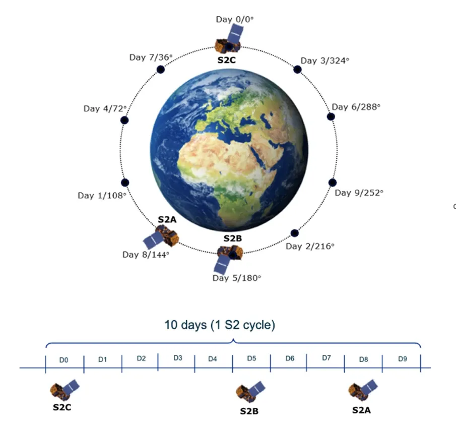
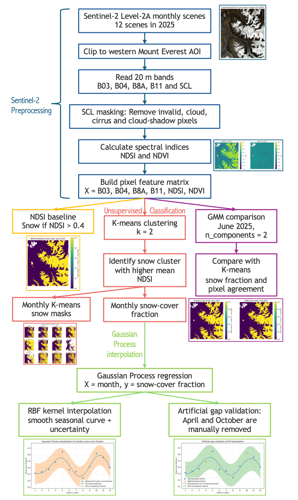

# Everest Snow Cover AI4EO
### Monitoring seasonal snow-cover variability in the western Mount Everest region during 2025 using Sentinel-2 imagery, unsupervised classification, and Gaussian Process interpolation.

<p align="center">
  
</p>

## Table of Contents

- [Project Overview](#project-overview)
- [Background and Problem Statement](#background-and-problem-statement)
- [Data and Study Area](#data-and-study-area)
- [Getting Started and Repository Structure](#getting-started-and-repository-structure)
- [Methodology](#methodology)
- [Results](#results)
- [Environmental Cost Assessment](#environmental-cost-assessment)
- [Limitations and Future Work](#limitations-and-future-work)
- [References](#references)
- [Contact](#contact)
- [Acknowledgement](#acknowledgement)

## Project Overview

This project monitors seasonal snow-cover variability in a selected western Mount Everest Area of Interest (AOI) during 2025.It uses 12 monthly Sentinel-2 Level-2A scenes to map snow cover, compare an NDSI-threshold baseline with K-means unsupervised classification, test Gaussian Mixture Model (GMM) on one representative month, and reconstruct a smooth seasonal snow-cover curve using Gaussian Process regression.

The workflow produces monthly snow masks, monthly snow-cover fractions, a K-means and GMM method comparison for one representative month, and a Gaussian Process interpolation with uncertainty and artificial gap validation.

## Background and Problem Statement

Seasonal snow cover in high mountains influences hydrology, climate processes and water availability, because river systems depend partly on snow and glacier melt during the summer months, while snow accumulates again in winter. Therefore, monitoring snow cover variability is helpful for understanding changes in mountain water resources, which is especially important in steep mountain terrain, where snow cover can vary strongly over short distances because of elevation, slope, aspect and local shading (Kulkarni et al., 2010). This project applies this issue to a selected AOI in the **western Mount Everest region during 2025**, where seasonal snow, ice, exposed rock and shadowed terrain make local snow-cover mapping useful but challenging.

Satellite remote sensing is suitable for this study because field observations in high mountain terrains are difficult, spatially limited and affected by harsh weather conditions. Sentinel-2 provides freely available multispectral imagery that records reflected radiation from the Earth’s surface across visible, near-infrared and short-wave infrared bands. These spectral bands can be used for snow mapping because **snow has a distinctive optical signal that is usually bright in visible wavelengths but much darker in the short-wave infrared.** Sentinel-2 also provides relatively high spatial resolution, with 10 m, 20 m and 60 m bands, and the combined Sentinel-2A/B constellation has a frequent revisit time, making it suitable for regional snow-cover monitoring (Nagajothi et al., 2019; Wang et al., 2022).

However, optical snow mapping is still challenging because snow, cloud, shadow, water and mixed pixels can be confused with each other or obscure the land surface. A common remote-sensing approach is to use the Normalised Difference Snow Index (NDSI), which uses the contrast between high green reflectance and low short-wave infrared reflectance of snow (Gascoin et al., 2019). This method is simple and widely used, but a fixed threshold may not capture all local surface conditions in complex mountain terrain. Monthly optical observations may also be incomplete or uneven because of cloud cover and scene availability.

**The aim of this project is to develop a compact AI4EO workflow for mapping and reconstructing seasonal snow-cover variability in the selected western Mount Everest AOI during 2025.** The specific objectives are:

- to download and organise one Sentinel-2 Level-2A scene for each month of 2025;
- to calculate NDSI and NDVI after masking invalid, cloud-contaminated and cloud-shadow pixels;
- to compare a simple NDSI-threshold snow-cover baseline with K-means unsupervised classification;
- to use GMM on one representative month to check whether the K-means result is sensitive to the clustering method;
- to reconstruct a smooth seasonal snow-cover curve from monthly K-means snow-cover fractions using Gaussian Process regression, including uncertainty estimates and artificial gap validation.

<p align="center">
  
</p>

*Figure Source: https://eu-space.europa.eu/news/observer-sentinel-2a-extending-operations-meet-user-needs*

## Data and Study Area

This project uses Sentinel-2 Level-2A scene from the Copernicus Data Space. The study area is a selected Area of Interest (AOI) in the western Mount Everest region, covered by Sentinel-2 tile `45RVM`. The AOI is approximately bounded by 86.85–86.97°E and 28.05–28.17°N, with an approximate centre at 86.91°E, 28.11°N.

One Sentinel-2 imagery with the lowest reported cloud-cover value is downloaded for each month of 2025 from the available Sentinel-2 products, giving 12 monthly observations in total for the snow-cover analysis. All image processing was carried out on the 20 m grid because the SWIR band and the Scene Classification Layer used in this project are available at 20 m resolution, avoiding band-shape mismatches in further analysis.

<p align="left">
  
</p>

Information table of the downloaded materials:
| Item | Description |
|---|---|
| Satellite data | Sentinel-2 Level-2A |
| Data source | Copernicus Data Space |
| Time period | January–December 2025 |
| Study area | Western Mount Everest region AOI |
| AOI extent | 86.85–86.97°E, 28.05–28.17°N |
| AOI centre | 86.91°E, 28.11°N |
| Sentinel-2 tile | `45RVM` |
| Spatial grid used | 20 m |
| Number of scenes | 12 monthly scenes |
| Main derived output | Monthly snow-cover fraction |

## Getting Started and Repository Structure

### Running Order

The project is organised as three Jupyter notebooks, developed and run in Google Colab. The notebooks should be run in order because each stage uses outputs from the previous stage. 
| Notebook | Purpose |
|---|---|
| `01_sentinel2_data_acquisition.ipynb` | Searches, selects, downloads and extracts the monthly Sentinel-2 products. |
| `02_snow_cover_mapping_kmeans_gmm.ipynb` | Applies SCL masking, calculates NDSI and NDVI, creates NDSI-threshold and K-means snow masks, and compares K-means with GMM for one representative month. |
| `03_gp_interpolation_gap_validation.ipynb` | Uses the monthly K-means snow-cover fraction for Gaussian Process interpolation and artificial gap validation. |

Notebook 1  requires a Copernicus Data Space account to download the Sentinel-2 products. **The personal username and password should be entered securely when running the code and should not be stored directly in the notebook.**

### Getting Started

Google Drive is used to store downloaded Sentinel-2 products, processed files, metadata tables and exported figures.
- To mount Google Drive in Colab:

  ```python
  from google.colab import drive
  drive.mount('/content/drive')
  ```

- Some packages are imported directly from the Colab environment, while additional packages are installed inside the notebooks where needed. **For example, Notebook 3 installs GPy before running the GP model:**

  ```python
  !pip install GPy
  ```

  If Colab asks for a runtime restart after installing `GPy`, restart the runtime and then rerun the notebook cells from the beginning.

### Repository structure

The raw Sentinel-2 `.SAFE`, `.zip` and `.jp2` files are not included in this repository because of their large file size. The selected product metadata and derived outputs are provided instead.

```text
everest-snow-cover-ai4eo/
│
├── README.md
│
├── notebooks/
│   ├── 01_sentinel2_data_acquisition.ipynb
│   ├── 02_snow_cover_mapping_kmeans_gmm.ipynb
│   └── 03_gp_interpolation_gap_validation.ipynb
│
├── figures/
│   ├── fig_01_aoi_true_colour_june_2025.png
│   ├── fig_02_ndsi_ndvi_june_2025.png
│   ├── fig_03_monthly_kmeans_snow_masks_2025.png
│   ├── fig_04_kmeans_vs_gmm_june_2025.png
│   ├── fig_05_monthly_snow_fraction_timeseries_2025.png
│   ├── gp_interpolation_snow_fraction_2025.png
│   └── gp_artificial_gap_validation_2025.png
│
├── illustrations/
│   ├── Sentinel2.png
│   ├── kmeans_concept_diagram.png
│   └── overall_workflow.png
│
└── metadata/
    ├── selected_monthly_products_2025.csv
    ├── snow_fraction_timeseries_2025.csv
    ├── gp_interpolated_snow_fraction_2025.csv
    └── gp_artificial_gap_validation_2025.csv
```

## Methodology

### 1. Remote Sensing Preprocessing

The selected Sentinel-2 Level-2A products were firstly read from the extracted `SAFE` folders. Then, each monthly 20 m Sentinel-2 layers was clipped to the selected western Everest AOI. The SCL layer was used to remove invalid pixels, cloud-contaminated pixels, cirrus and cloud shadows. Snow/ice pixels were eventually retained as the target class in this project.

Two spectral indices were calculated from the Sentinel-2 reflectance bands. The Normalised Difference Snow Index (NDSI) was used as the main snow-sensitive index:

$$
NDSI = \frac{B03 - B11}{B03 + B11}
$$

where `B03` is the green band and `B11` is the short-wave infrared (SWIR) band (Nagajothi et al., 2019).
NDVI was also calculated as an auxiliary feature to help describe vegetation and other non-snow surfaces:

$$
NDVI = \frac{B8A - B04}{B8A + B04}
$$

where `B8A` is the narrow near-infrared band (NIR) and `B04` is the red band (Tempa et al., 2024).

<p align="center">
  
</p>

### 2. NDSI Threshold Baseline

A simple NDSI threshold method was used as a baseline snow-cover estimate. After SCL masking, valid pixels with `NDSI > 0.4` were classified as snow, following a commonly used threshold for binary snow mapping (Dozier, 1989; Kulkarni et al., 2010).

The snow-cover fraction for each month was calculated as:

$$
\mathrm{Snow\ cover\ fraction} = \frac{\mathrm{number\ of\ snow\ pixels}}{\mathrm{number\ of\ valid\ pixels}}
$$

This threshold-based test was used as a reference for comparing with the K-means classification, rather than as independent ground truth.

### 3. K-means Unsupervised Snow Classification

K-means is an unsupervised clustering algorithm that groups pixels with similar feature values without using labelled training data. In this project, **it was used as the main snow-classification method to separate valid pixels into two broad surface groups.**

For each monthly scene, the valid pixels were reshaped into a pixel-by-feature matrix using six input features:

- `B03` (green)
- `B04` (red)
- `B8A` (narrow NIR)
- `B11` (SWIR)
- `NDSI`
- `NDVI`

The K-means model was applied with `k = 2`, so that the valid pixels were separated into two clusters by minimising the within-cluster variance. After clustering, the mean NDSI value of each cluster was calculated. The cluster with the higher mean NDSI was interpreted as the snow cluster, and the other cluster was treated as non-snow.

<p align="center">
  
</p>

### 4. Gaussian Mixture Model (GMM) Comparison

While K-means assigns pixels to the nearest cluster centre, GMM represents each cluster as a probability distribution. This makes GMM suitable for checking whether the snow/non-snow separation is strongly affected by the choice of clustering method.

GMM was applied only to the representative example of June 2025, using the same feature stack as the K-means classification, and the higher mean NDSI was also interpreted as the snow cluster. The resulting GMM snow mask was then compared with the K-means snow mask using snow-cover fraction and pixel-level agreement.

<p align="center">
  
</p>

*This comparison is used as a method check rather than a full validation dataset, because no independent ground-truth snow labels were available.*

### 5. Gaussian Process Interpolation and Gap Validation

The Gaussian Process regression used the monthly K-means snow-cover fraction as the input time series. In this project, the input variable is month number, and the output variable is snow-cover fraction.

Gaussian Process regression treats the seasonal snow-cover curve as a distribution of possible smooth functions, rather than fitting one fixed equation. An RBF kernel was used to describe the similarity between months:

$$
k(x, x') = \exp\left(-\frac{1}{2l^2} \| x - x' \|^2\right)
$$

This kernel includes a variance parameter and assumes that nearby months are more likely to have similar snow-cover fractions than months that are farther apart. The GP model was then used to reconstruct a seasonal snow-cover curve from the 12 monthly observations and to estimate the uncertainty between observed months.

An artificial gap validation was also carried out. April and October were removed from the time series, and a new GP model was trained using the remaining months. The model predictions for the two removed months were then compared with their original K-means snow-cover fractions. This tests whether the GP model can reasonably estimate missing monthly observations.

### 6. Machine Learning Implementation Workflow

The workflow below summarises how the Sentinel-2 preprocessing, spectral-index calculation, unsupervised classification and Gaussian Process interpolation steps are connected. Small example outputs are included to show how the intermediate and final products are generated through the pipeline.

<p align="center">
  
</p>

## Results

The main results show that K-means produced snow-cover masks for all 12 monthly Sentinel-2 scenes, K-means and GMM were highly consistent for the representative June scene, and the Gaussian Process model reconstructed a smooth seasonal snow-cover curve with uncertainty estimates.

### 1. Monthly K-means Snow Masks

<p align="center">
  
</p>

The monthly K-means masks show clear seasonal changes in the study region, but the cloud covers are also significant during the summer. These masks also provide the pixel-level basis for calculating monthly snow-cover fraction.

### 2. NDSI Threshold vs K-means Snow Cover Fraction

<p align="center">
  
</p>

The NDSI threshold and K-means results show broadly similar seasonal variability, but their snow-cover fractions are not identical. This is expected because the NDSI method uses a fixed single-index threshold, while K-means uses multiple Sentinel-2 bands and spectral indices to group pixels. **In this dataset, the NDSI-threshold baseline generally gives a more inclusive snow estimate, whereas K-means provides a more conservative classification by considering the wider spectral behaviour of each pixel.** These differences are most likely to occur in mixed pixels, shadowed terrain, and pixels with intermediate NDSI values.

### 3. K-means and GMM comparison

| Method | Month | Snow-cover fraction |
|---|---:|---:|
| K-means | June | 0.365666 |
| GMM | June | 0.366181 |

The pixel-level agreement between K-means and GMM was 0.9948, meaning that about 99.5% of valid pixels received the same snow/non-snow label from both methods. This supports the use of K-means as the main classification method for the full monthly analysis.

### 4. Gaussian Process Seasonal Reconstruction

<p align="center">
  
</p>

The GP model reconstructs a smooth seasonal snow-cover curve from the 12 monthly K-means observation results. The uncertainty interval is wider between observations and near the edges of the time series, reflecting less confidence where fewer neighbouring observations constrain the prediction.

### 5. Artificial gap validation

<p align="center">
  
</p>

The GP model was trained on the remaining months after April and October were temporarily removed from the dataset. A good gap-filling result is indicated when the predicted values are close to the original observations and the observed values fall within the uncertainty intervals.

| Held-out month | Observed K-means snow-cover fraction | GP predicted snow-cover fraction | 95% uncertainty interval | Absolute error | Within 95% interval? |
|---|---:|---:|---:|---:|:---:|
| April | 0.483 | 0.528 | 0.334–0.721 | 0.044 | Yes |
| October | 0.621 | 0.507 | 0.310–0.704 | 0.114 | Yes |

The full validation table is available in [`metadata/gp_artificial_gap_validation_2025.csv`](metadata/gp_artificial_gap_validation_2025.csv).

## Environmental Cost Assessment

Although this project was completed online using existing satellite data, it still has a potential environmental cost. Energy is used when running code in Google Colab, downloading Sentinel-2 data, storing files in Google Drive, and transferring outputs through the internet. This section provides an approximate estimate of the computational carbon footprint for one clean run of the complete workflow.

The calculation follows the same general logic as carbon-tracking tools such as CodeCarbon (https://github.com/mlco2/codecarbon), which estimate hardware electricity consumption from CPU, GPU and RAM use, and multiply it by the carbon intensity of the electricity supply. In this project, the estimate focuses on Colab computation because the exact carbon cost of network transfer and Google Drive storage is not directly available. 

### Data Used for Environmental Cost Estimation

The estimate is based on one clean CPU-only run of the three notebooks. Therefore, it does not include the time and energy used by repeated debugging runs, long-term cloud storage, Google Drive replication, network routing, or the construction and launch of the Sentinel-2 satellites.

| Assumption | Value used | Reason |
|---|---:|---|
| Runtime: Notebook 1 | 45 min | Data search, download and extraction |
| Runtime: Notebook 2 | 30 min | Preprocessing, K-means and GMM |
| Runtime: Notebook 3 | 5 min | GP interpolation and validation |
| Hardware | CPU only | No GPU training was used |
| Average IT power draw | 100 W | Approximate CPU-only Colab workload |
| Data-centre PUE | 1.09 | Google reported a 2025 global data centers average annual Power Usage Effectiveness (PUE) of 1.09 (https://datacenters.google/efficiency) |
| Electricity carbon factor | 0.177 kg CO₂e/kWh | UK Government 2025 GHG conversion factors are used as a transparent reporting assumption. (https://www.savemoneycutcarbon.com/learn-save/desnz-2025-emissions-factors)|

The calculation used:

$$
\mathrm{Energy\ (kWh)} = \mathrm{runtime\ (hours)} \times \mathrm{IT\ power\ (kW)} \times \mathrm{PUE}
$$

$$
\mathrm{Emissions\ (kg\ CO_2e)} = \mathrm{Energy\ (kWh)} \times \mathrm{carbon\ intensity\ (kg\ CO_2e/kWh)}
$$

### Estimated Carbon Emissions for Computation

| Workflow phase | Runtime | Energy incl. PUE | Estimated emissions |
|---|---:|---:|---:|
| Notebook 1: data acquisition / download / unzip | 45 min | 0.0818 kWh | 14.47 g CO₂e |
| Notebook 2: preprocessing + K-means/GMM | 30 min | 0.0545 kWh | 9.65 g CO₂e |
| Notebook 3: GP interpolation + validation | 5 min | 0.0091 kWh | 1.61 g CO₂e |
| **Total clean workflow** | **80 min** | **0.1453 kWh** | **25.72 g CO₂e** |

The exact Colab hardware is unknown, so the assumed IT power used here is 100 W, and the calculated results should be treated as an approximate estimate. A simple uncertainty range is also carried out by changing the assumed IT power value:

| Scenario | Assumed IT power | Estimated emissions |
|---|---:|---:|
| Low estimate | 50 W | 12.86 g CO₂e |
| Baseline estimate | 100 W | 25.72 g CO₂e |
| High estimate | 200 W | 51.45 g CO₂e |

### Data Transfer and Storage

The largest data component of this project is the Sentinel-2 input imagery. The 12 downloaded `.zip` products have a total size of approximately 13.22 GB. The extracted `.SAFE` folders should be larger, but their exact size was not recorded. The derived outputs are much smaller, with the metadata files at about 74 KB, and the exported figures around 8.0 MB in total.

| Data component | Approximate size | Treatment in this assessment |
|---|---:|---|
| Downloaded Sentinel-2 `.zip` products | 13.22 GB | Reported as data-transfer and storage load, but not converted to CO₂e |
| Extracted `.SAFE` products | Not recorded | Larger than the `.zip` products; stored in Google Drive |
| Metadata files | 74 KB | Very small compared with raw Sentinel-2 data |
| Exported figures | ~8.0 MB | Very small compared with raw Sentinel-2 data |

The carbon cost of data transfer and storage was not calculated into CO₂ emission value because it depends on unknown factors such as data centre location, storage duration, replication, network routing and storage hardware. **However, they should not be ignored when considering energy cost.**

### Advantages of This Project Considering Energy Cost

**This project has a relatively small carbon footprint because it uses lightweight CPU-based methods rather than deep-learning model training.** K-means, GMM and Gaussian Process regression are much less time and energy consuming comparing to training a large neural network. The workflow also limits unnecessary processing by using a small AOI, selecting one Sentinel-2 scene per month, and avoiding repeated processing of full tiles where possible.

The project uses existing open-access Sentinel-2 data rather than collecting new field data. Satellite-based works can reduce the need for repeated field visits to remote high-mountain regions which may require long-distance travel, specialist equipment or higher-risk field logistics. For comparison, the US EPA states that an average passenger vehicle emits about 400 g CO₂ per mile driven (https://www.epa.gov/greenvehicles/greenhouse-gas-emissions-typical-passenger-vehicle). Under the baseline estimate, one clean run of this project is roughly equivalent to about 0.064 miles (about 100 metres) of driving. Better snow-cover monitoring can also support hydrological awareness, water-resource planning and climate-impact assessment in mountain regions.

### Disadvantages and Uncertainties

The calculation only represents one run of the notebooks, so it is only a minimal estimate. **The real project footprint would be higher if repeated development and debugging runs were included.** The estimate also excludes considerations on network-transfer emissions, long-term Google Drive storage energy caused, and the volume of water used for data-centre cooling.

The workflow is low-carbon compared with many larger machine learning projects, but **its consumption is not zero** either. The main environmental cost is likely associated with downloading and storing the Sentinel-2 products rather than the machine-learning models themselves.

## Limitations and Future Work

- **Limited Temporal Sampling:** Only one Sentinel-2 scene was selected for each month, so the monthly snow-cover fraction represents one selected observation rather than a full monthly average. Future work could use multiple low-cloud scenes per month if available.
- **No Independent Ground Truth:** The NDSI threshold and GMM comparison did provide useful checks, but they are not a formal accuracy assessment, and cannot provide basis for a formal confusion matrix. Future work could compare the snow masks with labelled snow products or higher-resolution reference images.
- **Mountain Terrain and Optical Imagery Impacts:** Cloud, shadow, topographic effects and mixed pixels can still affect the classification even K-means is used. Future work could include DEM-based variables such as elevation, slope and aspect, or test SAR-based methods for cloud-affected periods.
- Also, The workflow was tested on one western Mount Everest AOI in 2025, so wider application would require testing across more years and additional Himalayan regions.

## References

### Essays
Dozier, J. (1989). Spectral signature of alpine snow cover from the Landsat Thematic Mapper. Remote sensing of environment, 28, 9-22.
Gascoin, S., Grizonnet, M., Bouchet, M., Salgues, G., & Hagolle, O. (2019). Theia Snow collection: High-resolution operational snow cover maps from Sentinel-2 and Landsat-8 data. Earth System Science Data, 11(2), 493-514.
Gaur, M. (2021). The Estimation of snow cover distribution using satellite data in the cold arid leh region of Indian himalaya. Polish Journal of Environmental Studies.
Kulkarni, A. V., Rathore, B. P., & Singh, S. K. (2010). Distribution of seasonal snow cover in central and western Himalaya. Annals of Glaciology, 51(54), 123-128.
Nagajothi, V., Priya, M. G., & Sharma, P. (2019). Snow cover estimation of western himalayas using sentinel-2 high spatial resolution data. Indian Journal of Ecology, 46(1), 88-93.
Tempa, K., Ilunga, M., Agarwal, A., & Tashi. (2024). Utilizing Sentinel-2 satellite imagery for LULC and NDVI change dynamics for Gelephu, Bhutan. Applied Sciences, 14(4), 1578.
Wang, Y., Su, J., Zhai, X., Meng, F., & Liu, C. (2022). Snow coverage mapping by learning from sentinel-2 satellite multispectral images via machine learning algorithms. Remote Sensing, 14(3), 782.

### Website Sources
https://datacenters.google/efficiency
https://eu-space.europa.eu/news/observer-sentinel-2a-extending-operations-meet-user-needs
https://github.com/mlco2/codecarbon
https://www.epa.gov/greenvehicles/greenhouse-gas-emissions-typical-passenger-vehicle
https://www.savemoneycutcarbon.com/learn-save/desnz-2025-emissions-factors

## Contact

Author: Yueheng Huang
Email: zcfbhua@ucl.ac.uk
Institution: Department of Earth Sciences, University College London
Course: GEOL0069 - AI for Earth Observation 2025-2026

## Acknowledgement

This project was created as the final project of GEOL0069-AI for Earth Observation at University College London. Many thanks to Dr. Michel Tsamados for his patient explanation throughout the course, and thanks to Weibin Chen and Shambhu Bhandari Sharma for helping solve the errors occurred during the practical sessions.
