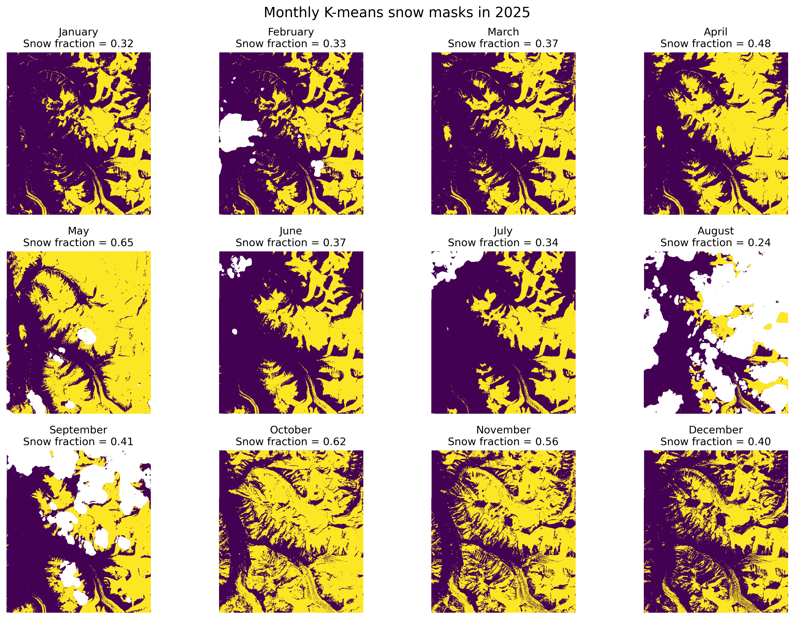

# Everest Snow Cover AI4EO
### Monitoring seasonal snow-cover variability in the western Mount Everest during 2025 using Sentinel-2 imagery, unsupervised classification, and Gaussian Process interpolation.

## Project Overview

This project aims to map and estimate seasonal snow-cover variability in a selected area of the western Everest using one Sentinel-2 Level-2A scene for each month of 2025.

The Sentinel-2 images are first clipped to the study area and filtered using the Scene Classification Layer (SCL) to remove invalid, cloud-contaminated and cloud-shadow pixels. Normalized Difference Snow Index (NDSI) and Normalized Difference Vegetation Index (NDVI) are then calculated from the Sentinel-2 reflectance bands.

A fixed NDSI-threshold method is used as a baseline, while K-means clustering is then applied as the main unsupervised classification method to separate snow-dominated and non-snow-dominated pixels. A Gaussian Mixture Model (GMM) is also tested on one representative June scene to compare with the K-means classification, and see if the snow/non-snow classification is sensitive to different unsupervised learning methods.

Finally, the monthly K-means snow-cover fractions are used as input for Gaussian Process regression to reconstruct a seasonal snow-cover curve with uncertainty estimates. An artificial gap validation is also included to test whether the Gaussian Process model can reasonably estimate missing monthly observations.

The main outputs are monthly snow masks, a snow-cover fraction time series, a Gaussian Process seasonal reconstruction, and a simple validation of gap-filling performance.

## Background and Problem Statement

Seasonal snow cover is crucial in high-mountain regions because it influences hydrology, climate processes and water availability. Himalayan river systems depend partly on snow and glacier melt during the summer months, and the snow is accumulated again in the winter, so monitoring the snow cover variability is helpful for understanding changes in mountain water resources (Kulkarni et al., 2010). This project applies this problems to a selected Area of Interest (AOI) in the western Mount Everest region, where steep topography, seasonal snow, rock, ice and shadowed terrain make local snow-cover mapping a useful but challenging remote sensing task.

Satellite remote sensing is suitable for this problem because field observations in high mountain topography are difficult, spatially limited and affected by harsh weather conditions. Sentinel-2 provides freely available multispectral imagery with relatively high resolution, which makes it suitable for regional snow-cover mapping (Nagajothi et al., 2019). However, optical snow mapping is still challenging because the snow is highly reflective, and the cloud, shadow, water and mixed pixels can be confused with the snow signal or obscure the land surface (Gaur et al., 2021). A common remote sensing approach is to use the Normalised Difference Snow Index (NDSI), which uses the contrast between high green reflectance and low short-wave infrared reflectance of snow (Gascoin et al., 2019). This method is simple and widely used, but a fixed threshold may not capture all local surface conditions in complex mountain terrain. 

Therefore, this project combines an NDSI threshold baseline with K-means unsupervised classification for the target site, grouping pixels using multiple Sentinel-2 bands and spectral indices without requiring manually labelled training data. The second challenge is that monthly optical observations may be incomplete or uneven because of cloud cover and scene availability. To address this issue, a Gaussian Process regression is carried out using the monthly K-means snow-cover fractions, reconstructing a smooth seasonal snow-cover curve and providing uncertainty estimates between monthly observations. 

